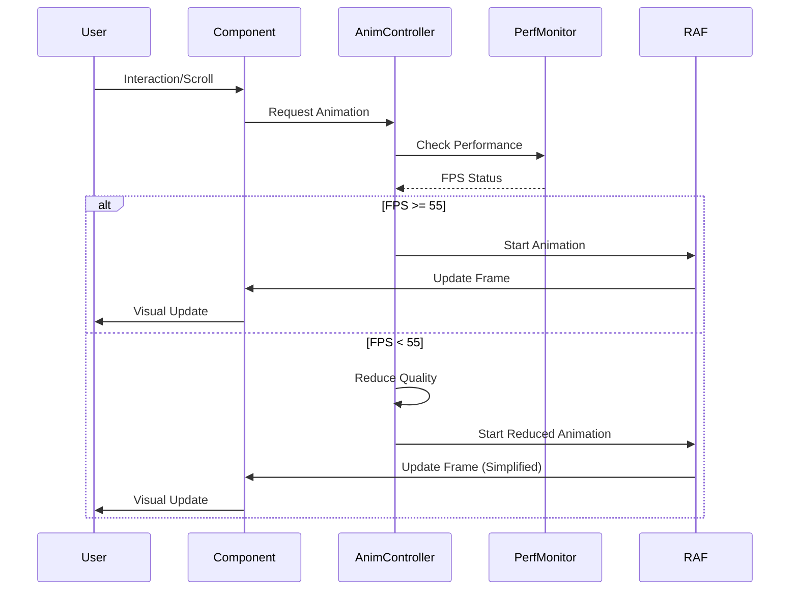
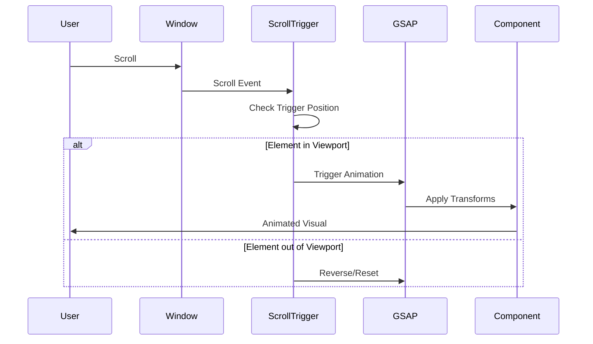

# Design Document: Landing Page Hyperframes Overhaul

## Overview

This design document specifies the technical architecture for a complete overhaul of the landing page using a hyperframes aesthetic with extensive 3D animations, glassmorphism effects, parallax scrolling, and interactive elements. The system will transform the current landing page into an ultra-modern, visually stunning experience while maintaining 60fps performance across devices.

### Design Goals

- **Immersive 3D Experience**: Create depth and dimensionality through Three.js 3D rendering, CSS 3D transforms, and layered parallax effects
- **Premium Visual Design**: Implement glassmorphism UI components with backdrop blur, animated gradients, and floating elements
- **Smooth Performance**: Maintain 60fps across all animations through GPU acceleration, requestAnimationFrame loops, and performance monitoring
- **Progressive Enhancement**: Provide full functionality with reduced animation complexity on mobile devices and respect reduced motion preferences
- **Modular Architecture**: Build reusable animation components with centralized performance control

### Technology Stack

**Core Libraries:**
- **Three.js** (r160+): WebGL-based 3D rendering for hero section 3D elements
- **GSAP 3.12+** with ScrollTrigger plugin: Timeline-based animations and scroll-triggered effects
- **Framer Motion 12.x**: React component animations and micro-interactions (already installed)
- **React 18.2**: Component framework (already installed)

**Native APIs:**
- **Canvas API**: High-performance particle system rendering
- **Intersection Observer API**: Viewport visibility detection for lazy animation triggering
- **requestAnimationFrame**: Smooth 60fps animation loops
- **matchMedia**: Reduced motion and mobile device detection

**Styling:**
- **CSS3**: Glassmorphism effects, 3D transforms, GPU-accelerated animations
- **Tailwind CSS 3.3**: Utility-first styling (already installed)

## Architecture

### System Architecture Diagram

```mermaid
graph TB
    subgraph "Landing Page Application"
        App[App.jsx]
        AnimController[Animation Controller]
        PerfMonitor[Performance Monitor]
        
        subgraph "3D Layer"
            HeroScene[HeroScene3D]
            Float3D[FloatingElement3D]
            Interactive3D[Interactive3DCard]
        end
        
        subgraph "Animation Layer"
            ScrollWrapper[ScrollTriggerWrapper]
            AnimText[AnimatedText]
            ParticleSystem[ParticleSystem]
            AnimGradient[AnimatedGradient]
        end
        
        subgraph "UI Layer"
            GlassCard[GlassCard]
            GlassButton[GlassButton]
            GlassInput[GlassInput]
            AnimNav[AnimatedNav]
            ScrollProgress[ScrollProgress]
        end
        
        subgraph "Hooks"
            MousePos[useMousePosition]
            ScrollProg[useScrollProgress]
            ReducedMotion[useReducedMotion]
            PerfHook[usePerformanceMonitor]
        end
    end
    
    App --> AnimController
    AnimController --> PerfMonitor
    AnimController --> 3D Layer
    AnimController --> Animation Layer
    AnimController --> UI Layer
    
    3D Layer --> Hooks
    Animation Layer --> Hooks
    UI Layer --> Hooks
    
    PerfMonitor -.->|throttle| AnimController
```

### Architecture Layers

**1. Animation Controller Layer**
- Central orchestration of all animations
- Performance monitoring and automatic quality adjustment
- Frame rate tracking with fallback strategies
- Animation priority management based on viewport visibility

**2. 3D Rendering Layer**
- Three.js scene management with camera, lighting, and 3D objects
- Mouse-tracking 3D transformations
- Floating element physics simulation
- GPU-optimized rendering pipeline

**3. Scroll Animation Layer**
- GSAP ScrollTrigger integration for scroll-based animations
- Parallax scrolling with multiple depth layers
- Intersection Observer for lazy animation triggering
- Smooth scroll behavior with easing functions

**4. UI Component Layer**
- Glassmorphism components with backdrop-filter
- Micro-interactions with Framer Motion
- Animated navigation with scroll-responsive behavior
- Form inputs with focus animations

**5. Performance Optimization Layer**
- Lazy loading of heavy libraries (Three.js, GSAP)
- Code splitting for animation components
- Mobile detection with reduced complexity
- Reduced motion detection and fallbacks

## Components and Interfaces

### 3D Components

#### HeroScene3D

**Purpose**: Main 3D scene container using Three.js for immersive hero section

**Props Interface**:
```typescript
interface HeroScene3DProps {
  mouseTracking?: boolean;        // Enable mouse-based parallax (default: true)
  floatingElements?: number;      // Number of floating 3D objects (default: 3)
  rotationSpeed?: number;         // Base rotation speed (default: 0.001)
  enableParticles?: boolean;      // Show particle system (default: true)
  quality?: 'low' | 'medium' | 'high'; // Rendering quality
}
```

**Three.js Scene Configuration**:
```javascript
// Camera setup
const camera = new THREE.PerspectiveCamera(
  75,                    // FOV
  window.innerWidth / window.innerHeight,  // Aspect ratio
  0.1,                   // Near clipping plane
  1000                   // Far clipping plane
);
camera.position.z = 5;

// Lighting setup
const ambientLight = new THREE.AmbientLight(0xffffff, 0.5);
const directionalLight = new THREE.DirectionalLight(0xffffff, 0.8);
directionalLight.position.set(5, 5, 5);

const pointLight = new THREE.PointLight(0x00ffff, 1, 100);
pointLight.position.set(0, 0, 10);

// Renderer configuration
const renderer = new THREE.WebGLRenderer({
  antialias: true,
  alpha: true,
  powerPreference: 'high-performance'
});
renderer.setPixelRatio(Math.min(window.devicePixelRatio, 2)); // Cap at 2x for performance
```

**3D Objects**:
- Geometric shapes (icosahedron, torus, octahedron) with wireframe materials
- Low-polygon models for performance (< 1000 vertices per object)
- Continuous rotation animations on multiple axes
- Mouse-responsive position offsets

**Implementation Details**:
```javascript
// Mouse tracking transformation
const handleMouseMove = (event) => {
  const mouseX = (event.clientX / window.innerWidth) * 2 - 1;
  const mouseY = -(event.clientY / window.innerHeight) * 2 + 1;
  
  // Apply parallax to 3D objects
  objects.forEach((obj, index) => {
    const depth = (index + 1) * 0.5;
    obj.position.x = mouseX * depth;
    obj.position.y = mouseY * depth;
  });
};

// Animation loop
const animate = () => {
  requestAnimationFrame(animate);
  
  // Rotate objects
  objects.forEach(obj => {
    obj.rotation.x += 0.001;
    obj.rotation.y += 0.002;
  });
  
  renderer.render(scene, camera);
};
```

#### FloatingElement3D

**Purpose**: Reusable 3D element with continuous floating motion

**Props Interface**:
```typescript
interface FloatingElement3DProps {
  geometry: 'sphere' | 'box' | 'torus' | 'icosahedron';
  amplitude?: number;           // Vertical motion range in px (default: 20)
  duration?: number;            // Animation cycle duration in seconds (default: 5)
  delay?: number;               // Animation start delay in seconds (default: 0)
  rotationRange?: number;       // Rotation angle range in degrees (default: 5)
  color?: string;               // Element color (default: '#00ffff')
  wireframe?: boolean;          // Render as wireframe (default: true)
}
```

**Animation Pattern**:
```javascript
// Sine wave floating motion
const floatingAnimation = (time, amplitude, duration, delay) => {
  const adjustedTime = time - delay;
  if (adjustedTime < 0) return 0;
  
  return Math.sin((adjustedTime / duration) * Math.PI * 2) * amplitude;
};

// Apply to element position
element.position.y = baseY + floatingAnimation(elapsedTime, amplitude, duration, delay);
element.rotation.z = Math.sin(elapsedTime * 0.5) * (rotationRange * Math.PI / 180);
```

#### Interactive3DCard

**Purpose**: 3D card component that responds to mouse position with tilt effect

**Props Interface**:
```typescript
interface Interactive3DCardProps {
  children: React.ReactNode;
  maxRotation?: number;         // Maximum tilt angle in degrees (default: 15)
  perspective?: number;         // CSS perspective value in px (default: 1500)
  transitionSpeed?: number;     // Return to neutral speed in ms (default: 800)
  glowEffect?: boolean;         // Enable glow on hover (default: true)
}
```

**CSS 3D Transform Implementation**:
```css
.interactive-3d-card {
  transform-style: preserve-3d;
  perspective: var(--perspective, 1500px);
  transition: transform var(--transition-speed, 0.8s) cubic-bezier(0.23, 1, 0.32, 1);
  will-change: transform;
}

.interactive-3d-card:hover {
  transform: 
    rotateX(var(--rotate-x, 0deg))
    rotateY(var(--rotate-y, 0deg))
    translateZ(20px);
}
```

**Mouse Tracking Calculation**:
```javascript
const handleMouseMove = (e) => {
  const rect = cardRef.current.getBoundingClientRect();
  const x = e.clientX - rect.left;
  const y = e.clientY - rect.top;
  
  const centerX = rect.width / 2;
  const centerY = rect.height / 2;
  
  const rotateX = ((y - centerY) / centerY) * maxRotation;
  const rotateY = ((x - centerX) / centerX) * maxRotation;
  
  cardRef.current.style.setProperty('--rotate-x', `${-rotateX}deg`);
  cardRef.current.style.setProperty('--rotate-y', `${rotateY}deg`);
};
```

### Glassmorphism Components

#### GlassCard

**Purpose**: Card component with glassmorphism effect

**Props Interface**:
```typescript
interface GlassCardProps {
  children: React.ReactNode;
  blur?: number;                // Backdrop blur in px (default: 10)
  opacity?: number;             // Background opacity 0-1 (default: 0.2)
  borderOpacity?: number;       // Border opacity 0-1 (default: 0.2)
  padding?: string;             // Padding value (default: '1.5rem')
  hoverLift?: boolean;          // Enable hover lift effect (default: true)
  className?: string;
}
```

**CSS Implementation**:
```css
.glass-card {
  background: rgba(255, 255, 255, var(--opacity, 0.2));
  backdrop-filter: blur(var(--blur, 10px));
  -webkit-backdrop-filter: blur(var(--blur, 10px)); /* Safari support */
  border: 1px solid rgba(255, 255, 255, var(--border-opacity, 0.2));
  border-radius: 16px;
  padding: var(--padding, 1.5rem);
  box-shadow: 0 8px 32px rgba(0, 0, 0, 0.1);
  transition: transform 0.3s cubic-bezier(0.34, 1.56, 0.64, 1);
  will-change: transform;
}

.glass-card:hover {
  transform: translateY(-6px);
  box-shadow: 0 12px 48px rgba(0, 0, 0, 0.15);
}
```

**Browser Compatibility Fallback**:
```javascript
// Detect backdrop-filter support
const supportsBackdropFilter = CSS.supports('backdrop-filter', 'blur(10px)') ||
                                CSS.supports('-webkit-backdrop-filter', 'blur(10px)');

// Fallback for unsupported browsers
const fallbackStyle = {
  background: 'rgba(255, 255, 255, 0.9)',
  backdropFilter: 'none'
};
```

#### GlassButton

**Purpose**: Button with glassmorphism effect and micro-interactions

**Props Interface**:
```typescript
interface GlassButtonProps {
  children: React.ReactNode;
  onClick?: () => void;
  variant?: 'primary' | 'secondary' | 'accent';
  size?: 'sm' | 'md' | 'lg';
  rippleEffect?: boolean;       // Enable ripple on click (default: true)
  glowColor?: string;           // Glow color on hover (default: '#00ffff')
}
```

**CSS with Micro-interactions**:
```css
.glass-button {
  background: rgba(255, 255, 255, 0.15);
  backdrop-filter: blur(12px);
  border: 1px solid rgba(255, 255, 255, 0.3);
  border-radius: 12px;
  padding: 0.75rem 1.5rem;
  cursor: pointer;
  position: relative;
  overflow: hidden;
  transition: all 0.2s cubic-bezier(0.34, 1.56, 0.64, 1);
  will-change: transform, box-shadow;
}

.glass-button:hover {
  transform: scale(1.05);
  box-shadow: 0 0 20px var(--glow-color, rgba(0, 255, 255, 0.5));
  background: rgba(255, 255, 255, 0.25);
}

.glass-button:active {
  transform: scale(0.95);
}

/* Ripple effect */
.glass-button::after {
  content: '';
  position: absolute;
  top: 50%;
  left: 50%;
  width: 0;
  height: 0;
  border-radius: 50%;
  background: rgba(255, 255, 255, 0.5);
  transform: translate(-50%, -50%);
  transition: width 0.6s, height 0.6s;
}

.glass-button:active::after {
  width: 300px;
  height: 300px;
}
```

#### GlassInput

**Purpose**: Input field with glassmorphism effect and focus animations

**Props Interface**:
```typescript
interface GlassInputProps {
  type?: string;
  placeholder?: string;
  value?: string;
  onChange?: (e: React.ChangeEvent<HTMLInputElement>) => void;
  focusGlow?: boolean;          // Enable glow on focus (default: true)
  icon?: React.ReactNode;       // Optional icon
}
```

**CSS with Focus Animations**:
```css
.glass-input {
  background: rgba(255, 255, 255, 0.1);
  backdrop-filter: blur(10px);
  border: 1px solid rgba(255, 255, 255, 0.2);
  border-radius: 12px;
  padding: 0.875rem 1rem;
  color: #ffffff;
  transition: all 0.3s cubic-bezier(0.34, 1.56, 0.64, 1);
  will-change: transform, box-shadow, border-color;
}

.glass-input:focus {
  outline: none;
  transform: scale(1.02);
  border-color: rgba(0, 255, 255, 0.6);
  box-shadow: 0 0 20px rgba(0, 255, 255, 0.3);
  background: rgba(255, 255, 255, 0.15);
}

.glass-input::placeholder {
  color: rgba(255, 255, 255, 0.5);
}
```

### Animation Components

#### ScrollTriggerWrapper

**Purpose**: Wrapper component for GSAP ScrollTrigger animations

**Props Interface**:
```typescript
interface ScrollTriggerWrapperProps {
  children: React.ReactNode;
  animation?: 'fade' | 'slideUp' | 'slideLeft' | 'scale' | 'custom';
  duration?: number;            // Animation duration in seconds (default: 0.8)
  delay?: number;               // Animation delay in seconds (default: 0)
  stagger?: number;             // Stagger delay for children (default: 0)
  triggerStart?: string;        // ScrollTrigger start position (default: 'top 80%')
  triggerEnd?: string;          // ScrollTrigger end position (default: 'top 20%')
  scrub?: boolean;              // Link animation to scroll position (default: false)
  markers?: boolean;            // Show debug markers (default: false)
}
```

**GSAP ScrollTrigger Implementation**:
```javascript
import { gsap } from 'gsap';
import { ScrollTrigger } from 'gsap/ScrollTrigger';

gsap.registerPlugin(ScrollTrigger);

useEffect(() => {
  const element = elementRef.current;
  
  // Animation configurations
  const animations = {
    fade: { opacity: 0, y: 0 },
    slideUp: { opacity: 0, y: 80 },
    slideLeft: { opacity: 0, x: -80 },
    scale: { opacity: 0, scale: 0.9 }
  };
  
  const fromVars = animations[animation] || animations.fade;
  
  gsap.fromTo(element, 
    fromVars,
    {
      opacity: 1,
      y: 0,
      x: 0,
      scale: 1,
      duration: duration,
      delay: delay,
      ease: 'power3.out',
      scrollTrigger: {
        trigger: element,
        start: triggerStart,
        end: triggerEnd,
        scrub: scrub,
        markers: markers,
        toggleActions: 'play none none reverse'
      }
    }
  );
  
  return () => {
    ScrollTrigger.getAll().forEach(trigger => trigger.kill());
  };
}, []);
```

#### AnimatedText

**Purpose**: Text component with reveal and gradient animations

**Props Interface**:
```typescript
interface AnimatedTextProps {
  text: string;
  variant?: 'word' | 'character' | 'line';
  gradient?: boolean;           // Enable gradient animation (default: false)
  gradientColors?: string[];    // Gradient color stops
  revealDuration?: number;      // Reveal animation duration (default: 1.5)
  staggerDelay?: number;        // Delay between elements (default: 0.05)
}
```

**Text Reveal Implementation**:
```javascript
// Split text into words/characters
const splitText = (text, variant) => {
  if (variant === 'character') {
    return text.split('').map((char, i) => (
      <span key={i} className="char" style={{ '--index': i }}>
        {char === ' ' ? '\u00A0' : char}
      </span>
    ));
  }
  
  if (variant === 'word') {
    return text.split(' ').map((word, i) => (
      <span key={i} className="word" style={{ '--index': i }}>
        {word}&nbsp;
      </span>
    ));
  }
  
  return text;
};

// CSS animation
.char, .word {
  display: inline-block;
  opacity: 0;
  transform: translateY(20px);
  animation: reveal 0.6s cubic-bezier(0.34, 1.56, 0.64, 1) forwards;
  animation-delay: calc(var(--index) * var(--stagger-delay, 0.05s));
}

@keyframes reveal {
  to {
    opacity: 1;
    transform: translateY(0);
  }
}
```

**Gradient Animation**:
```css
.animated-text-gradient {
  background: linear-gradient(
    90deg,
    var(--color-1, #00ffff),
    var(--color-2, #ff00ff),
    var(--color-3, #ffff00)
  );
  background-size: 200% 100%;
  background-clip: text;
  -webkit-background-clip: text;
  -webkit-text-fill-color: transparent;
  animation: gradient-shift 8s ease-in-out infinite;
}

@keyframes gradient-shift {
  0%, 100% { background-position: 0% 50%; }
  50% { background-position: 100% 50%; }
}
```

#### ParticleSystem

**Purpose**: Canvas-based particle system with mouse interaction

**Props Interface**:
```typescript
interface ParticleSystemProps {
  particleCount?: number;       // Number of particles (default: 50, mobile: 20)
  particleColor?: string;       // Particle color (default: '#00ffff')
  particleSize?: number;        // Particle radius in px (default: 2)
  mouseRadius?: number;         // Mouse interaction radius (default: 100)
  mouseForce?: number;          // Mouse repulsion force (default: 0.5)
  velocity?: number;            // Base particle velocity (default: 0.5)
  boundary?: 'wrap' | 'bounce'; // Boundary behavior (default: 'wrap')
}
```

**Particle Class**:
```javascript
class Particle {
  constructor(canvas) {
    this.x = Math.random() * canvas.width;
    this.y = Math.random() * canvas.height;
    this.vx = (Math.random() - 0.5) * velocity;
    this.vy = (Math.random() - 0.5) * velocity;
    this.radius = particleSize;
  }
  
  update(canvas, mouseX, mouseY) {
    // Mouse interaction
    const dx = this.x - mouseX;
    const dy = this.y - mouseY;
    const distance = Math.sqrt(dx * dx + dy * dy);
    
    if (distance < mouseRadius) {
      const force = (mouseRadius - distance) / mouseRadius * mouseForce;
      this.vx += (dx / distance) * force;
      this.vy += (dy / distance) * force;
    }
    
    // Update position
    this.x += this.vx;
    this.y += this.vy;
    
    // Boundary handling
    if (boundary === 'wrap') {
      if (this.x < 0) this.x = canvas.width;
      if (this.x > canvas.width) this.x = 0;
      if (this.y < 0) this.y = canvas.height;
      if (this.y > canvas.height) this.y = 0;
    } else if (boundary === 'bounce') {
      if (this.x < 0 || this.x > canvas.width) this.vx *= -1;
      if (this.y < 0 || this.y > canvas.height) this.vy *= -1;
    }
    
    // Velocity damping
    this.vx *= 0.99;
    this.vy *= 0.99;
  }
  
  draw(ctx) {
    ctx.beginPath();
    ctx.arc(this.x, this.y, this.radius, 0, Math.PI * 2);
    ctx.fillStyle = particleColor;
    ctx.fill();
  }
}
```

**Animation Loop**:
```javascript
const animate = () => {
  animationFrameId = requestAnimationFrame(animate);
  
  // Clear canvas
  ctx.clearRect(0, 0, canvas.width, canvas.height);
  
  // Update and draw particles
  particles.forEach(particle => {
    particle.update(canvas, mousePosition.x, mousePosition.y);
    particle.draw(ctx);
  });
};
```

#### AnimatedGradient

**Purpose**: Animated gradient background component

**Props Interface**:
```typescript
interface AnimatedGradientProps {
  colors: string[];             // Gradient color stops (min 3)
  duration?: number;            // Animation cycle duration in seconds (default: 10)
  type?: 'linear' | 'radial';   // Gradient type (default: 'linear')
  angle?: number;               // Linear gradient angle in degrees (default: 45)
  blendMode?: string;           // CSS blend mode (default: 'normal')
}
```

**CSS Implementation**:
```css
.animated-gradient {
  position: absolute;
  inset: 0;
  background: linear-gradient(
    var(--angle, 45deg),
    var(--color-1),
    var(--color-2),
    var(--color-3)
  );
  background-size: 200% 200%;
  animation: gradient-animation var(--duration, 10s) ease-in-out infinite;
  mix-blend-mode: var(--blend-mode, normal);
}

@keyframes gradient-animation {
  0% { background-position: 0% 50%; }
  50% { background-position: 100% 50%; }
  100% { background-position: 0% 50%; }
}

/* Radial gradient variant */
.animated-gradient-radial {
  background: radial-gradient(
    circle at center,
    var(--color-1),
    var(--color-2),
    var(--color-3)
  );
  background-size: 200% 200%;
  animation: gradient-radial-animation var(--duration, 10s) ease-in-out infinite;
}

@keyframes gradient-radial-animation {
  0%, 100% { transform: scale(1) rotate(0deg); }
  50% { transform: scale(1.2) rotate(180deg); }
}
```

### Navigation Components

#### AnimatedNav

**Purpose**: Navigation bar with glassmorphism and scroll-responsive behavior

**Props Interface**:
```typescript
interface AnimatedNavProps {
  links: Array<{ label: string; href: string }>;
  showOnScroll?: boolean;       // Show after scrolling past hero (default: true)
  hideOnScrollDown?: boolean;   // Hide when scrolling down (default: true)
  glassmorphism?: boolean;      // Enable glassmorphism effect (default: true)
}
```

**Scroll Behavior Implementation**:
```javascript
const [isVisible, setIsVisible] = useState(true);
const [isScrolled, setIsScrolled] = useState(false);
const lastScrollY = useRef(0);

useEffect(() => {
  const handleScroll = () => {
    const currentScrollY = window.scrollY;
    
    // Show glassmorphism after scrolling past hero
    setIsScrolled(currentScrollY > window.innerHeight * 0.5);
    
    // Hide on scroll down, show on scroll up
    if (hideOnScrollDown) {
      if (currentScrollY > lastScrollY.current && currentScrollY > 100) {
        setIsVisible(false);
      } else {
        setIsVisible(true);
      }
    }
    
    lastScrollY.current = currentScrollY;
  };
  
  window.addEventListener('scroll', handleScroll, { passive: true });
  return () => window.removeEventListener('scroll', handleScroll);
}, []);
```

**CSS with Transitions**:
```css
.animated-nav {
  position: fixed;
  top: 0;
  left: 0;
  right: 0;
  z-index: 1000;
  padding: 1rem 2rem;
  transition: 
    transform 0.3s cubic-bezier(0.34, 1.56, 0.64, 1),
    background 0.3s ease,
    backdrop-filter 0.3s ease;
  transform: translateY(0);
}

.animated-nav.hidden {
  transform: translateY(-100%);
}

.animated-nav.scrolled {
  background: rgba(255, 255, 255, 0.1);
  backdrop-filter: blur(12px);
  box-shadow: 0 4px 24px rgba(0, 0, 0, 0.1);
}

/* Active indicator */
.nav-indicator {
  position: absolute;
  bottom: 0;
  height: 2px;
  background: linear-gradient(90deg, #00ffff, #ff00ff);
  transition: left 0.3s cubic-bezier(0.34, 1.56, 0.64, 1), width 0.3s cubic-bezier(0.34, 1.56, 0.64, 1);
}
```

#### ScrollProgress

**Purpose**: Scroll progress indicator with animated gradient

**Props Interface**:
```typescript
interface ScrollProgressProps {
  position?: 'top' | 'bottom' | 'left' | 'right';
  height?: number;              // Indicator thickness in px (default: 3)
  colors?: string[];            // Gradient colors (default: ['#00ffff', '#ff00ff'])
  glowIntensity?: number;       // Glow effect intensity 0-1 (default: 0.5)
}
```

**Implementation**:
```javascript
const [scrollProgress, setScrollProgress] = useState(0);

useEffect(() => {
  const handleScroll = () => {
    const windowHeight = window.innerHeight;
    const documentHeight = document.documentElement.scrollHeight;
    const scrollTop = window.scrollY;
    
    const progress = (scrollTop / (documentHeight - windowHeight)) * 100;
    setScrollProgress(Math.min(progress, 100));
  };
  
  window.addEventListener('scroll', handleScroll, { passive: true });
  return () => window.removeEventListener('scroll', handleScroll);
}, []);
```

**CSS**:
```css
.scroll-progress {
  position: fixed;
  top: 0;
  left: 0;
  height: var(--height, 3px);
  width: var(--progress, 0%);
  background: linear-gradient(90deg, var(--color-1, #00ffff), var(--color-2, #ff00ff));
  box-shadow: 0 0 calc(var(--glow-intensity, 0.5) * 20px) var(--color-1);
  transition: width 0.1s ease-out;
  z-index: 9999;
}
```

## Data Models

### Animation State

```typescript
interface AnimationState {
  isPlaying: boolean;
  fps: number;
  quality: 'low' | 'medium' | 'high';
  reducedMotion: boolean;
  isMobile: boolean;
  activeAnimations: Set<string>;
}
```

### Performance Metrics

```typescript
interface PerformanceMetrics {
  currentFPS: number;
  averageFPS: number;
  frameDrops: number;
  lastFrameTime: number;
  animationCount: number;
}
```

### Mouse Position

```typescript
interface MousePosition {
  x: number;
  y: number;
  normalizedX: number;  // -1 to 1
  normalizedY: number;  // -1 to 1
}
```

### Scroll Data

```typescript
interface ScrollData {
  scrollY: number;
  scrollProgress: number;  // 0 to 100
  direction: 'up' | 'down';
  velocity: number;
}
```

## Data Flow

### Animation Lifecycle



### Scroll Animation Flow




## Error Handling

### Animation Errors

**Three.js Initialization Failures**:
```javascript
try {
  const renderer = new THREE.WebGLRenderer({ antialias: true, alpha: true });
  // ... setup
} catch (error) {
  console.error('WebGL initialization failed:', error);
  // Fallback to CSS 3D transforms
  setUse3DFallback(true);
}
```

**GSAP Loading Errors**:
```javascript
const loadGSAP = async () => {
  try {
    const gsap = await import('gsap');
    const ScrollTrigger = await import('gsap/ScrollTrigger');
    return { gsap: gsap.default, ScrollTrigger: ScrollTrigger.default };
  } catch (error) {
    console.error('GSAP loading failed:', error);
    // Fallback to CSS animations
    return null;
  }
};
```

### Performance Degradation

**Frame Rate Monitoring**:
```javascript
class PerformanceMonitor {
  constructor() {
    this.frames = [];
    this.lastTime = performance.now();
    this.fpsThreshold = 55;
  }
  
  measureFrame() {
    const now = performance.now();
    const delta = now - this.lastTime;
    this.lastTime = now;
    
    const fps = 1000 / delta;
    this.frames.push(fps);
    
    // Keep last 60 frames
    if (this.frames.length > 60) {
      this.frames.shift();
    }
    
    return this.getAverageFPS();
  }
  
  getAverageFPS() {
    return this.frames.reduce((a, b) => a + b, 0) / this.frames.length;
  }
  
  shouldReduceQuality() {
    return this.getAverageFPS() < this.fpsThreshold;
  }
}
```

**Automatic Quality Reduction**:
```javascript
const handlePerformanceDegradation = (currentFPS) => {
  if (currentFPS < 55 && quality === 'high') {
    setQuality('medium');
    console.warn('Reducing animation quality to medium');
  } else if (currentFPS < 45 && quality === 'medium') {
    setQuality('low');
    console.warn('Reducing animation quality to low');
  } else if (currentFPS < 30) {
    setAnimationsEnabled(false);
    console.warn('Disabling non-essential animations');
  }
};
```

### Browser Compatibility

**Backdrop-filter Fallback**:
```javascript
const getGlassmorphismStyles = () => {
  const supportsBackdropFilter = 
    CSS.supports('backdrop-filter', 'blur(10px)') ||
    CSS.supports('-webkit-backdrop-filter', 'blur(10px)');
  
  if (supportsBackdropFilter) {
    return {
      background: 'rgba(255, 255, 255, 0.2)',
      backdropFilter: 'blur(10px)',
      WebkitBackdropFilter: 'blur(10px)'
    };
  }
  
  // Fallback for unsupported browsers
  return {
    background: 'rgba(255, 255, 255, 0.85)',
    backdropFilter: 'none'
  };
};
```

**Intersection Observer Fallback**:
```javascript
const observeElement = (element, callback) => {
  if ('IntersectionObserver' in window) {
    const observer = new IntersectionObserver(
      (entries) => {
        entries.forEach(entry => {
          if (entry.isIntersecting) {
            callback(entry);
          }
        });
      },
      { threshold: 0.1 }
    );
    
    observer.observe(element);
    return () => observer.disconnect();
  } else {
    // Fallback: trigger immediately
    callback({ isIntersecting: true, target: element });
    return () => {};
  }
};
```

### Resource Loading Errors

**Lazy Loading with Error Handling**:
```javascript
const loadThreeJS = async () => {
  try {
    const THREE = await import('three');
    return THREE;
  } catch (error) {
    console.error('Failed to load Three.js:', error);
    showErrorMessage('3D features unavailable');
    return null;
  }
};

const loadGSAP = async () => {
  try {
    const gsap = await import('gsap');
    const ScrollTrigger = await import('gsap/ScrollTrigger');
    gsap.registerPlugin(ScrollTrigger);
    return { gsap, ScrollTrigger };
  } catch (error) {
    console.error('Failed to load GSAP:', error);
    showErrorMessage('Advanced animations unavailable');
    return null;
  }
};
```

## Testing Strategy

### Unit Testing

**Component Testing with React Testing Library**:
```javascript
// GlassCard.test.jsx
import { render, screen } from '@testing-library/react';
import { GlassCard } from './GlassCard';

describe('GlassCard', () => {
  it('renders children correctly', () => {
    render(<GlassCard>Test Content</GlassCard>);
    expect(screen.getByText('Test Content')).toBeInTheDocument();
  });
  
  it('applies custom blur value', () => {
    const { container } = render(<GlassCard blur={15}>Content</GlassCard>);
    const card = container.firstChild;
    expect(card).toHaveStyle({ '--blur': '15px' });
  });
  
  it('applies hover lift effect', () => {
    const { container } = render(<GlassCard hoverLift={true}>Content</GlassCard>);
    const card = container.firstChild;
    expect(card).toHaveClass('hover-lift');
  });
});
```

**Hook Testing**:
```javascript
// useMousePosition.test.js
import { renderHook, act } from '@testing-library/react';
import { useMousePosition } from './useMousePosition';

describe('useMousePosition', () => {
  it('tracks mouse position', () => {
    const { result } = renderHook(() => useMousePosition());
    
    act(() => {
      const event = new MouseEvent('mousemove', {
        clientX: 100,
        clientY: 200
      });
      window.dispatchEvent(event);
    });
    
    expect(result.current.x).toBe(100);
    expect(result.current.y).toBe(200);
  });
  
  it('throttles updates', async () => {
    const { result } = renderHook(() => useMousePosition(100));
    let updateCount = 0;
    
    // Trigger multiple events rapidly
    for (let i = 0; i < 10; i++) {
      act(() => {
        const event = new MouseEvent('mousemove', { clientX: i });
        window.dispatchEvent(event);
      });
    }
    
    // Should throttle to fewer updates
    expect(updateCount).toBeLessThan(10);
  });
});
```

### Integration Testing

**Animation Flow Testing**:
```javascript
// ScrollAnimation.integration.test.jsx
import { render, screen } from '@testing-library/react';
import { ScrollTriggerWrapper } from './ScrollTriggerWrapper';

describe('ScrollTriggerWrapper Integration', () => {
  it('triggers animation on scroll', async () => {
    render(
      <ScrollTriggerWrapper animation="slideUp">
        <div data-testid="animated-element">Content</div>
      </ScrollTriggerWrapper>
    );
    
    const element = screen.getByTestId('animated-element');
    
    // Initially hidden
    expect(element).toHaveStyle({ opacity: '0' });
    
    // Simulate scroll
    window.scrollTo(0, 500);
    
    // Wait for animation
    await waitFor(() => {
      expect(element).toHaveStyle({ opacity: '1' });
    });
  });
});
```

**Performance Testing**:
```javascript
// Performance.integration.test.js
describe('Performance Monitoring', () => {
  it('maintains 60fps during animations', async () => {
    const monitor = new PerformanceMonitor();
    const frames = [];
    
    // Simulate 60 frames
    for (let i = 0; i < 60; i++) {
      await new Promise(resolve => requestAnimationFrame(resolve));
      frames.push(monitor.measureFrame());
    }
    
    const averageFPS = frames.reduce((a, b) => a + b) / frames.length;
    expect(averageFPS).toBeGreaterThanOrEqual(55);
  });
  
  it('reduces quality when FPS drops', () => {
    const controller = new AnimationController();
    
    // Simulate low FPS
    controller.handlePerformanceUpdate(45);
    
    expect(controller.quality).toBe('medium');
  });
});
```

### Visual Regression Testing

**Snapshot Testing for Glassmorphism**:
```javascript
// GlassCard.snapshot.test.jsx
import { render } from '@testing-library/react';
import { GlassCard } from './GlassCard';

describe('GlassCard Visual Regression', () => {
  it('matches snapshot', () => {
    const { container } = render(
      <GlassCard blur={10} opacity={0.2}>
        Test Content
      </GlassCard>
    );
    
    expect(container.firstChild).toMatchSnapshot();
  });
});
```

### End-to-End Testing

**Cypress E2E Tests**:
```javascript
// landing-page.e2e.cy.js
describe('Landing Page Animations', () => {
  beforeEach(() => {
    cy.visit('/');
  });
  
  it('loads hero section with 3D elements', () => {
    cy.get('[data-testid="hero-scene-3d"]').should('be.visible');
    cy.get('canvas').should('exist');
  });
  
  it('triggers scroll animations', () => {
    cy.get('[data-testid="feature-card"]').first().should('not.be.visible');
    
    cy.scrollTo(0, 800);
    
    cy.get('[data-testid="feature-card"]').first().should('be.visible');
    cy.get('[data-testid="feature-card"]').first().should('have.css', 'opacity', '1');
  });
  
  it('responds to mouse movement', () => {
    cy.get('[data-testid="interactive-3d-card"]')
      .trigger('mousemove', { clientX: 100, clientY: 100 });
    
    cy.get('[data-testid="interactive-3d-card"]')
      .should('have.css', 'transform')
      .and('include', 'rotate');
  });
  
  it('respects reduced motion preference', () => {
    cy.visit('/', {
      onBeforeLoad(win) {
        cy.stub(win, 'matchMedia')
          .withArgs('(prefers-reduced-motion: reduce)')
          .returns({ matches: true });
      }
    });
    
    // Animations should be disabled
    cy.get('[data-testid="floating-element"]')
      .should('not.have.css', 'animation');
  });
});
```

### Performance Testing

**Lighthouse CI Integration**:
```javascript
// lighthouserc.js
module.exports = {
  ci: {
    collect: {
      url: ['http://localhost:3000/'],
      numberOfRuns: 3
    },
    assert: {
      assertions: {
        'categories:performance': ['error', { minScore: 0.9 }],
        'first-contentful-paint': ['error', { maxNumericValue: 2000 }],
        'cumulative-layout-shift': ['error', { maxNumericValue: 0.1 }],
        'total-blocking-time': ['error', { maxNumericValue: 300 }]
      }
    }
  }
};
```

**Custom Performance Metrics**:
```javascript
// performance.test.js
describe('Animation Performance', () => {
  it('maintains 60fps with all animations active', async () => {
    const metrics = await measurePerformance(() => {
      // Trigger all animations
      scrollToBottom();
      moveMouseAround();
      interactWithElements();
    });
    
    expect(metrics.averageFPS).toBeGreaterThanOrEqual(55);
    expect(metrics.frameDrops).toBeLessThan(5);
  });
  
  it('loads Three.js lazily', async () => {
    const startTime = performance.now();
    
    // Initial page load should not include Three.js
    const initialBundleSize = await getBundleSize();
    expect(initialBundleSize).toBeLessThan(500 * 1024); // < 500KB
    
    // Scroll to hero section
    scrollToHero();
    
    // Three.js should load now
    await waitForThreeJS();
    const loadTime = performance.now() - startTime;
    
    expect(loadTime).toBeLessThan(1000); // < 1 second
  });
});
```

## Implementation Plan

### Phase 1: Foundation Setup (Week 1)

**Tasks:**
1. Install dependencies (Three.js, GSAP)
2. Create project structure with component folders
3. Implement base hooks (useMousePosition, useScrollProgress, useReducedMotion)
4. Set up animation controller and performance monitor
5. Create utility functions (easing, throttle, debounce)

**Deliverables:**
- `/hooks` folder with all custom hooks
- `/utils/animationController.js`
- `/utils/performanceOptimizer.js`
- Basic project structure

### Phase 2: Glassmorphism Components (Week 1-2)

**Tasks:**
1. Implement GlassCard component with backdrop-filter
2. Create GlassButton with micro-interactions
3. Build GlassInput with focus animations
4. Add browser compatibility fallbacks
5. Write unit tests for glassmorphism components

**Deliverables:**
- `/components/glassmorphism/` folder with all glass components
- CSS module for glassmorphism styles
- Unit tests with >80% coverage

### Phase 3: 3D Components (Week 2-3)

**Tasks:**
1. Set up Three.js scene in HeroScene3D
2. Implement FloatingElement3D with sine wave motion
3. Create Interactive3DCard with mouse tracking
4. Optimize 3D rendering for performance
5. Add lazy loading for Three.js

**Deliverables:**
- `/components/3d/` folder with 3D components
- Working hero section with 3D elements
- Performance benchmarks showing 60fps

### Phase 4: Animation Components (Week 3-4)

**Tasks:**
1. Integrate GSAP and ScrollTrigger
2. Build ScrollTriggerWrapper component
3. Implement AnimatedText with reveal effects
4. Create ParticleSystem with canvas
5. Build AnimatedGradient component

**Deliverables:**
- `/components/animations/` folder with animation components
- Working scroll-triggered animations
- Particle system with mouse interaction

### Phase 5: Navigation & UI (Week 4)

**Tasks:**
1. Build AnimatedNav with glassmorphism
2. Implement ScrollProgress indicator
3. Add scroll direction detection
4. Create active section indicator
5. Implement smooth scroll behavior

**Deliverables:**
- `/components/navigation/` folder
- Fully functional animated navigation
- Scroll progress indicator

### Phase 6: Integration & Optimization (Week 5)

**Tasks:**
1. Integrate all components into landing page
2. Implement performance monitoring
3. Add automatic quality reduction
4. Optimize for mobile devices
5. Add reduced motion support

**Deliverables:**
- Complete landing page with all features
- Performance monitoring dashboard
- Mobile-optimized experience

### Phase 7: Testing & Polish (Week 6)

**Tasks:**
1. Write comprehensive unit tests
2. Implement integration tests
3. Run E2E tests with Cypress
4. Perform visual regression testing
5. Conduct performance audits

**Deliverables:**
- Test suite with >80% coverage
- Lighthouse score >90
- Performance benchmarks
- Bug fixes and polish

## File Structure

```
landing/
├── src/
│   ├── components/
│   │   ├── 3d/
│   │   │   ├── HeroScene3D.jsx
│   │   │   ├── FloatingElement3D.jsx
│   │   │   ├── Interactive3DCard.jsx
│   │   │   └── index.js
│   │   ├── animations/
│   │   │   ├── ScrollTriggerWrapper.jsx
│   │   │   ├── AnimatedText.jsx
│   │   │   ├── ParticleSystem.jsx
│   │   │   ├── AnimatedGradient.jsx
│   │   │   └── index.js
│   │   ├── glassmorphism/
│   │   │   ├── GlassCard.jsx
│   │   │   ├── GlassButton.jsx
│   │   │   ├── GlassInput.jsx
│   │   │   └── index.js
│   │   ├── navigation/
│   │   │   ├── AnimatedNav.jsx
│   │   │   ├── ScrollProgress.jsx
│   │   │   └── index.js
│   │   ├── HeroSection.jsx (updated)
│   │   ├── FeaturesSection.jsx (updated)
│   │   └── Footer.jsx (updated)
│   ├── hooks/
│   │   ├── useMousePosition.js
│   │   ├── useScrollProgress.js
│   │   ├── useReducedMotion.js
│   │   ├── usePerformanceMonitor.js
│   │   ├── useIntersectionObserver.js
│   │   └── index.js
│   ├── utils/
│   │   ├── animationController.js
│   │   ├── performanceOptimizer.js
│   │   ├── easingFunctions.js
│   │   ├── throttle.js
│   │   ├── debounce.js
│   │   └── index.js
│   ├── styles/
│   │   ├── glassmorphism.css
│   │   ├── animations.css
│   │   ├── 3d-transforms.css
│   │   └── index.css (updated)
│   ├── App.jsx (updated)
│   └── main.jsx
├── tests/
│   ├── unit/
│   │   ├── components/
│   │   ├── hooks/
│   │   └── utils/
│   ├── integration/
│   └── e2e/
├── package.json (updated with new dependencies)
└── vite.config.js
```

## Dependencies Update

**package.json additions**:
```json
{
  "dependencies": {
    "framer-motion": "^12.38.0",
    "lucide-react": "^1.11.0",
    "react": "^18.2.0",
    "react-dom": "^18.2.0",
    "three": "^0.160.0",
    "gsap": "^3.12.5"
  },
  "devDependencies": {
    "@vitejs/plugin-react": "^6.0.1",
    "@testing-library/react": "^14.1.2",
    "@testing-library/jest-dom": "^6.1.5",
    "@testing-library/user-event": "^14.5.1",
    "vitest": "^1.0.4",
    "cypress": "^13.6.2",
    "autoprefixer": "^10.4.16",
    "postcss": "^8.4.32",
    "tailwindcss": "^3.3.6",
    "vite": "^8.0.3"
  }
}
```

## Performance Optimization Details

### GPU Acceleration Strategy

**CSS Properties for GPU Acceleration**:
```css
/* Use transform and opacity for GPU-accelerated animations */
.gpu-accelerated {
  transform: translate3d(0, 0, 0);
  will-change: transform, opacity;
}

/* Avoid animating these properties (CPU-bound) */
.avoid-animating {
  /* DON'T animate: width, height, top, left, margin, padding */
}

/* Prefer these GPU-accelerated properties */
.prefer-animating {
  /* DO animate: transform, opacity, filter */
}
```

**will-change Usage Guidelines**:
```javascript
// Add will-change just before animation
element.style.willChange = 'transform, opacity';

// Start animation
animate(element);

// Remove will-change after animation completes
element.addEventListener('animationend', () => {
  element.style.willChange = 'auto';
});
```

### RequestAnimationFrame Optimization

**Centralized Animation Loop**:
```javascript
class AnimationController {
  constructor() {
    this.animations = new Map();
    this.isRunning = false;
    this.frameId = null;
  }
  
  register(id, callback) {
    this.animations.set(id, callback);
    if (!this.isRunning) {
      this.start();
    }
  }
  
  unregister(id) {
    this.animations.delete(id);
    if (this.animations.size === 0) {
      this.stop();
    }
  }
  
  start() {
    this.isRunning = true;
    this.loop();
  }
  
  stop() {
    this.isRunning = false;
    if (this.frameId) {
      cancelAnimationFrame(this.frameId);
    }
  }
  
  loop() {
    if (!this.isRunning) return;
    
    // Execute all registered animations
    this.animations.forEach(callback => callback());
    
    this.frameId = requestAnimationFrame(() => this.loop());
  }
}
```

### Throttling and Debouncing

**Scroll Event Throttling**:
```javascript
const throttle = (func, limit) => {
  let inThrottle;
  return function(...args) {
    if (!inThrottle) {
      func.apply(this, args);
      inThrottle = true;
      setTimeout(() => inThrottle = false, limit);
    }
  };
};

// Usage: throttle scroll events to 16.67ms (60fps)
window.addEventListener('scroll', throttle(handleScroll, 16.67), { passive: true });
```

**Mouse Move Debouncing**:
```javascript
const debounce = (func, delay) => {
  let timeoutId;
  return function(...args) {
    clearTimeout(timeoutId);
    timeoutId = setTimeout(() => func.apply(this, args), delay);
  };
};

// Usage: debounce mouse move for less critical updates
element.addEventListener('mousemove', debounce(handleMouseMove, 50));
```

### Lazy Loading Strategy

**Dynamic Imports**:
```javascript
// Lazy load Three.js when hero section is visible
const loadThreeJS = async () => {
  if (!threeJSLoaded) {
    const THREE = await import('three');
    threeJSLoaded = true;
    return THREE;
  }
};

// Lazy load GSAP when scroll animations are needed
const loadGSAP = async () => {
  if (!gsapLoaded) {
    const gsap = await import('gsap');
    const ScrollTrigger = await import('gsap/ScrollTrigger');
    gsap.registerPlugin(ScrollTrigger);
    gsapLoaded = true;
    return { gsap, ScrollTrigger };
  }
};
```

**Code Splitting with React.lazy**:
```javascript
import { lazy, Suspense } from 'react';

// Lazy load heavy 3D components
const HeroScene3D = lazy(() => import('./components/3d/HeroScene3D'));
const ParticleSystem = lazy(() => import('./components/animations/ParticleSystem'));

// Usage with Suspense
<Suspense fallback={<LoadingSpinner />}>
  <HeroScene3D />
</Suspense>
```

### Mobile Optimization

**Device Detection**:
```javascript
const isMobile = () => {
  return /Android|webOS|iPhone|iPad|iPod|BlackBerry|IEMobile|Opera Mini/i.test(navigator.userAgent) ||
         window.innerWidth < 768;
};

const isLowEndDevice = () => {
  return navigator.hardwareConcurrency <= 4 ||
         navigator.deviceMemory <= 4;
};
```

**Adaptive Quality Settings**:
```javascript
const getQualitySettings = () => {
  if (isLowEndDevice()) {
    return {
      particleCount: 20,
      use3D: false,
      blurAmount: 5,
      animationComplexity: 'low'
    };
  }
  
  if (isMobile()) {
    return {
      particleCount: 30,
      use3D: false,
      blurAmount: 8,
      animationComplexity: 'medium'
    };
  }
  
  return {
    particleCount: 50,
    use3D: true,
    blurAmount: 10,
    animationComplexity: 'high'
  };
};
```

### Reduced Motion Support

**Detect and Respect User Preferences**:
```javascript
const useReducedMotion = () => {
  const [prefersReducedMotion, setPrefersReducedMotion] = useState(false);
  
  useEffect(() => {
    const mediaQuery = window.matchMedia('(prefers-reduced-motion: reduce)');
    setPrefersReducedMotion(mediaQuery.matches);
    
    const handleChange = (e) => setPrefersReducedMotion(e.matches);
    mediaQuery.addEventListener('change', handleChange);
    
    return () => mediaQuery.removeEventListener('change', handleChange);
  }, []);
  
  return prefersReducedMotion;
};
```

**Simplified Animations for Reduced Motion**:
```css
@media (prefers-reduced-motion: reduce) {
  * {
    animation-duration: 0.01ms !important;
    animation-iteration-count: 1 !important;
    transition-duration: 0.01ms !important;
  }
  
  .floating-element {
    animation: none;
  }
  
  .parallax-layer {
    transform: none !important;
  }
}
```

## Security Considerations

### Content Security Policy

**CSP Headers for WebGL and Canvas**:
```
Content-Security-Policy: 
  default-src 'self';
  script-src 'self' 'unsafe-eval';
  style-src 'self' 'unsafe-inline';
  img-src 'self' data: blob:;
  connect-src 'self';
```

### XSS Prevention

**Sanitize User Input**:
```javascript
// If accepting any user input for animations
const sanitizeInput = (input) => {
  return input.replace(/[<>\"']/g, '');
};
```

## Accessibility Considerations

### Keyboard Navigation

**Focus Management**:
```javascript
// Ensure all interactive elements are keyboard accessible
<GlassButton
  onClick={handleClick}
  onKeyDown={(e) => {
    if (e.key === 'Enter' || e.key === ' ') {
      handleClick();
    }
  }}
  tabIndex={0}
  aria-label="Action button"
>
  Click Me
</GlassButton>
```

### Screen Reader Support

**ARIA Labels for Animated Content**:
```jsx
<div 
  role="region"
  aria-label="Hero section with 3D animations"
  aria-live="polite"
>
  <HeroScene3D />
</div>
```

### Color Contrast

**Ensure Readable Text on Glassmorphism**:
```css
.glass-card {
  /* Ensure sufficient contrast */
  color: #ffffff;
  text-shadow: 0 2px 4px rgba(0, 0, 0, 0.5);
}

/* Check contrast ratio >= 4.5:1 for normal text */
/* Check contrast ratio >= 3:1 for large text */
```

## Monitoring and Analytics

### Performance Metrics Collection

**Track Animation Performance**:
```javascript
const trackPerformance = () => {
  const metrics = {
    fps: performanceMonitor.getAverageFPS(),
    animationCount: animationController.getActiveCount(),
    quality: animationController.getQuality(),
    deviceType: isMobile() ? 'mobile' : 'desktop'
  };
  
  // Send to analytics
  analytics.track('animation_performance', metrics);
};
```

### Error Tracking

**Monitor Animation Failures**:
```javascript
window.addEventListener('error', (event) => {
  if (event.message.includes('WebGL') || event.message.includes('Three')) {
    analytics.track('3d_error', {
      message: event.message,
      userAgent: navigator.userAgent
    });
  }
});
```

## Conclusion

This design provides a comprehensive architecture for transforming the landing page into an immersive, high-performance experience with 3D animations, glassmorphism effects, and smooth 60fps performance. The modular component structure, centralized animation control, and progressive enhancement strategy ensure the system works across all devices while providing the best possible experience on capable hardware.

Key success factors:
- **Performance First**: GPU acceleration, requestAnimationFrame, and automatic quality adjustment
- **Progressive Enhancement**: Full functionality with reduced complexity on mobile and respect for user preferences
- **Modular Architecture**: Reusable components with clear interfaces and separation of concerns
- **Comprehensive Testing**: Unit, integration, E2E, and performance testing strategies
- **Accessibility**: Keyboard navigation, screen reader support, and reduced motion compliance


## Creative Enhancements: Nerdy Academic Theme

### Additional Themed Components

#### FloatingBookElement3D

**Purpose**: Animated 3D books that float and flip pages in the hero section

**Visual Concept**:
- 3D book models with realistic page-turning animations
- Books orbit around central focal point
- Hover to make books open and reveal glowing content
- Different subjects: Math, Science, Literature, Code

**Three.js Implementation**:
```javascript
// Create book geometry with pages
const createBook = (subject) => {
  const bookGroup = new THREE.Group();
  
  // Book cover
  const coverGeometry = new THREE.BoxGeometry(1, 1.4, 0.1);
  const coverMaterial = new THREE.MeshStandardMaterial({
    color: subjectColors[subject],
    metalness: 0.3,
    roughness: 0.7
  });
  const cover = new THREE.Mesh(coverGeometry, coverMaterial);
  
  // Animated pages
  const pageGeometry = new THREE.PlaneGeometry(0.9, 1.3);
  const pageMaterial = new THREE.MeshStandardMaterial({
    color: 0xffffff,
    side: THREE.DoubleSide,
    transparent: true,
    opacity: 0.9
  });
  
  // Create multiple pages with stagger
  for (let i = 0; i < 10; i++) {
    const page = new THREE.Mesh(pageGeometry, pageMaterial);
    page.position.z = 0.05 + (i * 0.01);
    page.userData.pageIndex = i;
    bookGroup.add(page);
  }
  
  bookGroup.add(cover);
  return bookGroup;
};

// Page flip animation
const animatePageFlip = (book, time) => {
  book.children.forEach((page, index) => {
    if (page.userData.pageIndex !== undefined) {
      const delay = index * 0.1;
      const rotation = Math.sin(time + delay) * Math.PI;
      page.rotation.y = rotation;
    }
  });
};
```

#### CodeRainEffect

**Purpose**: Matrix-style code rain with educational content (formulas, code snippets)

**Canvas Implementation**:
```javascript
class CodeRain {
  constructor(canvas) {
    this.canvas = canvas;
    this.ctx = canvas.getContext('2d');
    this.columns = Math.floor(canvas.width / 20);
    this.drops = Array(this.columns).fill(0);
    
    // Educational content
    this.characters = [
      '∫', '∑', 'π', 'λ', 'Δ', 'Ω', // Math symbols
      '{', '}', '(', ')', '<', '>', // Code symbols
      '0', '1', 'x', 'y', 'f', 'g', // Variables
      'α', 'β', 'γ', 'θ', 'φ', 'ψ'  // Greek letters
    ];
  }
  
  draw() {
    // Fade effect
    this.ctx.fillStyle = 'rgba(0, 0, 0, 0.05)';
    this.ctx.fillRect(0, 0, this.canvas.width, this.canvas.height);
    
    // Draw characters
    this.ctx.fillStyle = '#0F0';
    this.ctx.font = '15px monospace';
    
    for (let i = 0; i < this.drops.length; i++) {
      const char = this.characters[Math.floor(Math.random() * this.characters.length)];
      const x = i * 20;
      const y = this.drops[i] * 20;
      
      this.ctx.fillText(char, x, y);
      
      if (y > this.canvas.height && Math.random() > 0.975) {
        this.drops[i] = 0;
      }
      
      this.drops[i]++;
    }
  }
}
```

#### FormulaParticleSystem

**Purpose**: Floating mathematical formulas and equations as particles

**Implementation**:
```javascript
class FormulaParticle {
  constructor(canvas) {
    this.x = Math.random() * canvas.width;
    this.y = Math.random() * canvas.height;
    this.vx = (Math.random() - 0.5) * 0.5;
    this.vy = (Math.random() - 0.5) * 0.5;
    
    // Famous formulas
    this.formulas = [
      'E=mc²',
      'a²+b²=c²',
      'F=ma',
      'PV=nRT',
      '∫f(x)dx',
      'Σ(x-μ)²',
      'e^(iπ)+1=0',
      'f(x)=mx+b'
    ];
    
    this.formula = this.formulas[Math.floor(Math.random() * this.formulas.length)];
    this.opacity = Math.random() * 0.5 + 0.3;
    this.scale = Math.random() * 0.5 + 0.5;
  }
  
  draw(ctx) {
    ctx.save();
    ctx.globalAlpha = this.opacity;
    ctx.font = `${16 * this.scale}px 'Courier New', monospace`;
    ctx.fillStyle = '#00ffff';
    ctx.fillText(this.formula, this.x, this.y);
    ctx.restore();
  }
}
```

#### PeriodicTableBackground

**Purpose**: Animated periodic table elements as background decoration

**CSS Grid Implementation**:
```css
.periodic-table-bg {
  position: absolute;
  inset: 0;
  display: grid;
  grid-template-columns: repeat(18, 1fr);
  grid-template-rows: repeat(10, 1fr);
  gap: 2px;
  opacity: 0.1;
  pointer-events: none;
}

.element-card {
  background: rgba(255, 255, 255, 0.05);
  border: 1px solid rgba(255, 255, 255, 0.1);
  display: flex;
  flex-direction: column;
  align-items: center;
  justify-content: center;
  font-size: 0.6rem;
  animation: element-glow 3s ease-in-out infinite;
  animation-delay: calc(var(--index) * 0.05s);
}

@keyframes element-glow {
  0%, 100% { 
    box-shadow: 0 0 5px rgba(0, 255, 255, 0.2);
    transform: scale(1);
  }
  50% { 
    box-shadow: 0 0 15px rgba(0, 255, 255, 0.5);
    transform: scale(1.05);
  }
}
```

#### DNAHelixAnimation

**Purpose**: Rotating DNA double helix in 3D space

**Three.js Implementation**:
```javascript
const createDNAHelix = () => {
  const helixGroup = new THREE.Group();
  const radius = 2;
  const height = 10;
  const segments = 50;
  
  // Create two strands
  for (let strand = 0; strand < 2; strand++) {
    const curve = new THREE.CatmullRomCurve3(
      Array.from({ length: segments }, (_, i) => {
        const t = i / segments;
        const angle = t * Math.PI * 4 + (strand * Math.PI);
        return new THREE.Vector3(
          Math.cos(angle) * radius,
          t * height - height / 2,
          Math.sin(angle) * radius
        );
      })
    );
    
    const tubeGeometry = new THREE.TubeGeometry(curve, segments, 0.1, 8, false);
    const tubeMaterial = new THREE.MeshStandardMaterial({
      color: strand === 0 ? 0x00ffff : 0xff00ff,
      emissive: strand === 0 ? 0x00ffff : 0xff00ff,
      emissiveIntensity: 0.3
    });
    
    const tube = new THREE.Mesh(tubeGeometry, tubeMaterial);
    helixGroup.add(tube);
  }
  
  // Add connecting base pairs
  for (let i = 0; i < segments; i += 3) {
    const t = i / segments;
    const angle1 = t * Math.PI * 4;
    const angle2 = angle1 + Math.PI;
    const y = t * height - height / 2;
    
    const point1 = new THREE.Vector3(
      Math.cos(angle1) * radius,
      y,
      Math.sin(angle1) * radius
    );
    
    const point2 = new THREE.Vector3(
      Math.cos(angle2) * radius,
      y,
      Math.sin(angle2) * radius
    );
    
    const lineGeometry = new THREE.BufferGeometry().setFromPoints([point1, point2]);
    const lineMaterial = new THREE.LineBasicMaterial({ color: 0xffffff, opacity: 0.5, transparent: true });
    const line = new THREE.Line(lineGeometry, lineMaterial);
    helixGroup.add(line);
  }
  
  return helixGroup;
};

// Animate rotation
const animateDNA = (helix, time) => {
  helix.rotation.y = time * 0.5;
};
```

#### TypewriterTextEffect

**Purpose**: Text that types out character by character with cursor

**Implementation**:
```javascript
const TypewriterText = ({ text, speed = 50, delay = 0 }) => {
  const [displayText, setDisplayText] = useState('');
  const [currentIndex, setCurrentIndex] = useState(0);
  const [showCursor, setShowCursor] = useState(true);
  
  useEffect(() => {
    if (currentIndex < text.length) {
      const timeout = setTimeout(() => {
        setDisplayText(prev => prev + text[currentIndex]);
        setCurrentIndex(prev => prev + 1);
      }, speed);
      
      return () => clearTimeout(timeout);
    }
  }, [currentIndex, text, speed]);
  
  useEffect(() => {
    const cursorInterval = setInterval(() => {
      setShowCursor(prev => !prev);
    }, 500);
    
    return () => clearInterval(cursorInterval);
  }, []);
  
  return (
    <span className="typewriter-text">
      {displayText}
      {showCursor && <span className="cursor">|</span>}
    </span>
  );
};
```

#### ChalkboardEffect

**Purpose**: Text that appears as if being written on a chalkboard

**CSS Implementation**:
```css
.chalkboard-text {
  font-family: 'Courier New', monospace;
  color: #ffffff;
  text-shadow: 0 0 5px rgba(255, 255, 255, 0.5);
  position: relative;
}

.chalkboard-text::before {
  content: attr(data-text);
  position: absolute;
  left: 0;
  top: 0;
  width: 0;
  overflow: hidden;
  color: rgba(255, 255, 255, 0.3);
  animation: chalk-write 2s steps(30) forwards;
}

@keyframes chalk-write {
  to { width: 100%; }
}

/* Chalk dust particles */
.chalk-dust {
  position: absolute;
  width: 2px;
  height: 2px;
  background: rgba(255, 255, 255, 0.6);
  border-radius: 50%;
  animation: dust-fall 1s ease-out forwards;
}

@keyframes dust-fall {
  to {
    transform: translateY(20px);
    opacity: 0;
  }
}
```

#### BinaryDataStream

**Purpose**: Flowing binary data streams in the background

**Canvas Implementation**:
```javascript
class BinaryStream {
  constructor(canvas, x) {
    this.canvas = canvas;
    this.x = x;
    this.y = -50;
    this.speed = Math.random() * 2 + 1;
    this.data = Array.from({ length: 20 }, () => Math.random() > 0.5 ? '1' : '0');
    this.opacity = Math.random() * 0.5 + 0.3;
  }
  
  update() {
    this.y += this.speed;
    if (this.y > this.canvas.height + 50) {
      this.y = -50;
      this.data = Array.from({ length: 20 }, () => Math.random() > 0.5 ? '1' : '0');
    }
  }
  
  draw(ctx) {
    ctx.save();
    ctx.globalAlpha = this.opacity;
    ctx.font = '12px monospace';
    ctx.fillStyle = '#00ff00';
    
    this.data.forEach((bit, index) => {
      ctx.fillText(bit, this.x, this.y + (index * 15));
    });
    
    ctx.restore();
  }
}
```

#### AtomOrbitAnimation

**Purpose**: Animated atom with orbiting electrons

**Three.js Implementation**:
```javascript
const createAtom = () => {
  const atomGroup = new THREE.Group();
  
  // Nucleus
  const nucleusGeometry = new THREE.SphereGeometry(0.3, 32, 32);
  const nucleusMaterial = new THREE.MeshStandardMaterial({
    color: 0xff0000,
    emissive: 0xff0000,
    emissiveIntensity: 0.5
  });
  const nucleus = new THREE.Mesh(nucleusGeometry, nucleusMaterial);
  atomGroup.add(nucleus);
  
  // Electron orbits
  const orbitCount = 3;
  const electrons = [];
  
  for (let i = 0; i < orbitCount; i++) {
    const orbitRadius = 1 + (i * 0.5);
    const orbitAngle = (i * Math.PI * 2) / orbitCount;
    
    // Orbit ring
    const orbitGeometry = new THREE.TorusGeometry(orbitRadius, 0.01, 16, 100);
    const orbitMaterial = new THREE.MeshBasicMaterial({
      color: 0x00ffff,
      transparent: true,
      opacity: 0.3
    });
    const orbit = new THREE.Mesh(orbitGeometry, orbitMaterial);
    orbit.rotation.x = Math.PI / 2 + orbitAngle;
    atomGroup.add(orbit);
    
    // Electron
    const electronGeometry = new THREE.SphereGeometry(0.1, 16, 16);
    const electronMaterial = new THREE.MeshStandardMaterial({
      color: 0x00ffff,
      emissive: 0x00ffff,
      emissiveIntensity: 0.8
    });
    const electron = new THREE.Mesh(electronGeometry, electronMaterial);
    electron.userData = { orbitRadius, orbitAngle, speed: 0.5 + (i * 0.2) };
    electrons.push(electron);
    atomGroup.add(electron);
  }
  
  atomGroup.userData.electrons = electrons;
  return atomGroup;
};

// Animate electrons
const animateAtom = (atom, time) => {
  atom.userData.electrons.forEach(electron => {
    const { orbitRadius, orbitAngle, speed } = electron.userData;
    const angle = time * speed + orbitAngle;
    electron.position.x = Math.cos(angle) * orbitRadius;
    electron.position.z = Math.sin(angle) * orbitRadius;
  });
};
```

### Enhanced Color Palette (Nerdy Academic Theme)

```javascript
const academicColorPalette = {
  // Primary colors
  cyberBlue: '#00ffff',
  neonPurple: '#ff00ff',
  electricYellow: '#ffff00',
  matrixGreen: '#00ff00',
  
  // Subject-specific colors
  math: '#4169E1',        // Royal Blue
  science: '#32CD32',     // Lime Green
  literature: '#9370DB',  // Medium Purple
  code: '#FF6347',        // Tomato Red
  
  // Accent colors
  chalkWhite: '#F5F5F5',
  blackboardGreen: '#2F4F2F',
  paperBeige: '#F5DEB3',
  inkBlue: '#191970'
};
```

### Crazy Animation Ideas

1. **Equation Solver Animation**: Watch equations solve themselves step-by-step
2. **Book Page Flip Transition**: Page transitions between sections
3. **Holographic Projection Effect**: Content appears as holographic projections
4. **Quantum Particle Effect**: Particles that exist in multiple states simultaneously
5. **Constellation Connect**: Stars that connect to form educational diagrams
6. **Fractal Zoom**: Infinite zoom into mathematical fractals
7. **Chemical Reaction**: Elements combining with particle effects
8. **Code Compilation**: Watch code compile with syntax highlighting
9. **Brain Neuron Network**: Animated neural connections
10. **Galaxy Spiral**: Content arranged in a spiral galaxy formation

These enhancements will make the landing page feel like a futuristic educational portal with personality and excitement!
